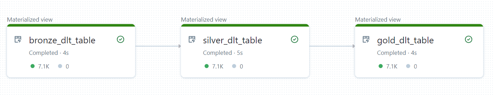
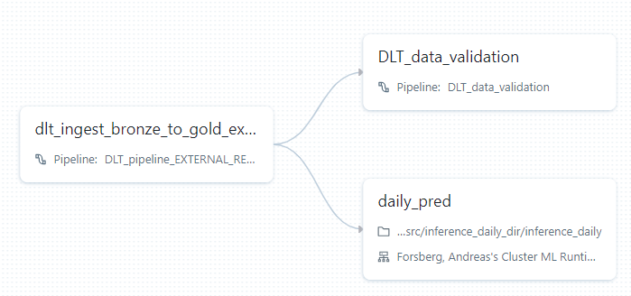
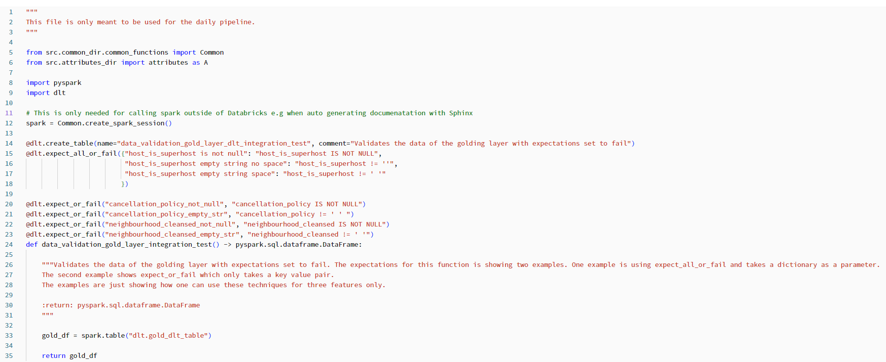
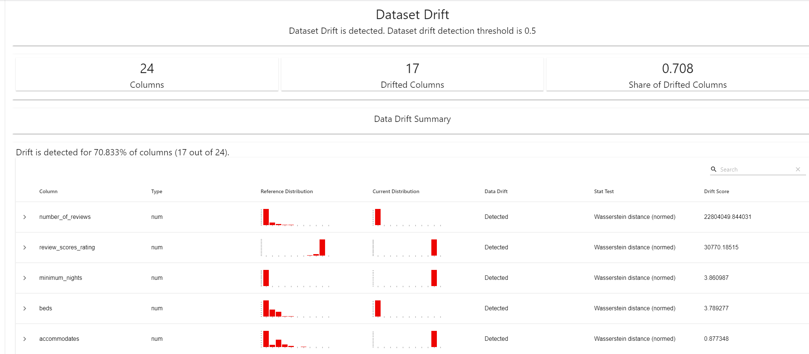
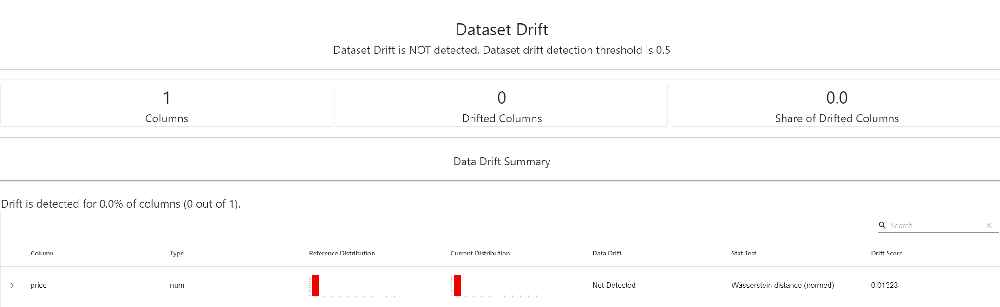
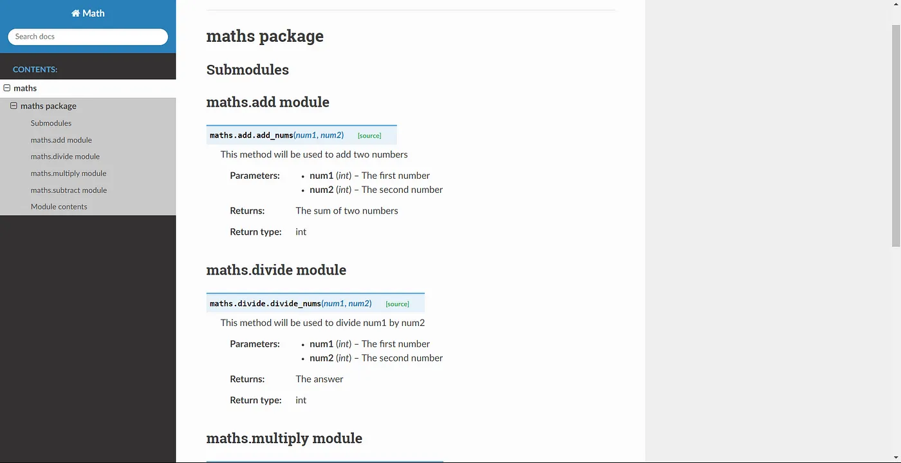

# mvp_of_a_ml_deliver
The README file is written more like a diary with a touch of documentation at the moment. Where I can sum up my thoughts and what I have learned of the assignment at VCC and from my Databricks certifications in spark, data engineering and machine learning. Please note that due to not having Azure admin rights (Your administrator has disabled the App registrations experience in the Azure portal), I could not use Autoloader, Azure Key Vault or trigger jobs via Job API.

## Aim of the project
The aim of the project was twofold. First, to try a bunch of methods, tools, approaches, techniques, you name it, that I have come across during my first year as a consultant but perhaps have not had the chance to try until now.
The time cap was roughly three weeks, so I want to emphasize that nothing in this project is exhaustive; it is more of a quick sneak peak.

The second aim of the project was to produce a project that a junior colleague could easily follow so they (count me in) could see what an end-to-end minimal viable product of a machine learning delivery may look like. At the same time, be of sufficient quality to a senior Data Scientist/AI Architect (Jonas Mellin), a senior Data Engineer (Johan Öhman) and a Databricks Champion (Alexander Mafi). The term sufficient here means, if they were to open up this project at a client for the first time, they would say, "OK, maybe not how I would have done it. But, OK" and accept it, rather than chase perfection. In short, for this project, simplicity is rated higher than perfection.   

## What I was trying to build
An ETL flow that reads from an external Azure Data Lake Storage Gen2 using a Databricks function called Autoloader while storing secrets in Azure Key Vault. Once the data is read from the source, it is currated through the medallion structure of bronze to gold. The ETL flow is built with Delta Live Tables (DLT) of which you can easily monitor the health of your incoming data by setting expectations. This ETL flow should be encapsulated by a job, which can be set to a schedule.

In the same job but as another task, should the daily prediction be performed. The gold standard data is sent to the trained machine learning (ML) model, which makes daily predictions. The ML model should have a few requirements. One, it should not brake for new data or if new columns are sent to it. Two, the health of the incoming data and the model should be automatically monitored, and alerts should be sent as soon as a data or model drift occurs. The drifts are monitored with something called Evidently, which is open source. Three, the model should be trained with Hyperopt, which is a Baysian optimization algorithm that speeds up training (risk of getting into local optima). The ML predictions are saved in a table, and the insights from the table are visualized in a dashboard that updates daily. 

### Requirements
This should be built in Databricks, utilizing testing and a CI/CD approach with three environments (DEV, TEST, PROD), be written in PySpark, and make use of a proper IDE. Visual Studio Code just recently launched a Databricks extension that I wanted to try out. In addition, I wanted to try something called Sphinx and Autodocstring, which are used for documentation. Sphinx produces a searchable web-based interface of your modules and functions, and Autodocstring produces a doc template for each function while coding. Explorative data analysis should be excluded. At least one of the modules should be written with a component oriented approach to show the foundations of how to do it. 

## Thoughts, learnings & what was actually built

If not mentioned otherwise, what was built is what was stated earlier. A blocker for this project was that I was not the administrator of my Visual Studio Professional subscription, which implies that I do not have certain privileges. I will try to get admin rights in order to keep developing the project as intended. This led to several compromises, as will be described below.

### Data
The data used for the project is the AirBnb San Fransisco and the purpose of the ML prediction is to predict the price.

`root
 |-- host_is_superhost: string
 |-- cancellation_policy: string
 |-- instant_bookable: string
 |-- host_total_listings_count: double
 |-- neighbourhood_cleansed: string
 |-- latitude: double
 |-- longitude: double
 |-- property_type: string
 |-- room_type: string
 |-- accommodates: double
 |-- bathrooms: double
 |-- bedrooms: double
 |-- beds: double
 |-- bed_type: string
 |-- minimum_nights: long
 |-- number_of_reviews: long
 |-- review_scores_rating: double
 |-- review_scores_accuracy: double
 |-- review_scores_cleanliness: double
 |-- review_scores_checkin: double
 |-- review_scores_communication: double
 |-- review_scores_location: double
 |-- review_scores_value: double
 |-- price: double`

### Autoloader and storing secrets in Azure Key Vault

Due to not having Azure admin rights (Your administrator has disabled the App registrations experience in the Azure portal), I could not use Autoloader or Azure Key Vault. The implication of not using Autoloader is a more complex solution where I use an upsert with Merge Into instead and manually keep track of which files have been upserted earlier. Since I could not use Azure Key Vault, I did a poor man's version of it and stored my secrets in a txt file and used gitignore to not push these files.

### ETL Flow
The DLT flow visualized as:



Job tasks visualized as:



Expectations for gold layer is set to not allow compromized data (seen as task DLT_data_validation above):



The medallion structure was developed according to a component based approach. However, be aware that this is not a real component in its essence. Due to its low re-usability. But it serves as an example of how to structure the interface, factory and main code (main code is just my name on where the majority of the program is run. I have not seen a specific name for that part). And, please ignore the Call saying RAW_INTERNAL_DATABASE, this will be changed in future. 

```
medallion = MF.MedallionFactory.create_or_get(
                version = MF.MedallionFactory.Version.V1,
                call = IM.IMedallion.Call.RAW_INTERNAL_DATABASE)

bronze_df = medallion.imedallion_read_adls_merge_raw_into_bronze_transformation(mnt_path=mnt_path, test_mode=test_mode)
```

### Testing & IDE

All modules have tests implemented using the Nutter test framework and code written in Databricks UI. However, the initial goal was to develop the code in a proper IDE such as Visual Studio Code and utilize the new Databricks Connection extension, which makes it possible to use the Databricks clusters and storage remotely. But because I did not have admin rights, the Databricks Connection extension did not work as intended. Therefore, most code and tests were developed in Databricks UI.

### ML model

The ML model did not brake for unseen data due to it is trained as a pipeline and then called as a pipeline with transformers such as PySparks StringIndexer included into the pipeline.  

```
categorical_cols = [field for (
        field, dataType) in train_df.dtypes if dataType == "string"]
    index_output_cols = [x + "_Index" for x in categorical_cols]

string_indexer = StringIndexer(
    inputCols=categorical_cols, outputCols=index_output_cols, handleInvalid="skip")

numeric_cols = [field for (field, dataType) in train_df.dtypes if (
    (dataType == "double") & (field != "price"))]

assembler_inputs = index_output_cols + numeric_cols

vec_assembler = VectorAssembler(
    inputCols=assembler_inputs, outputCol="features")

rf = RandomForestRegressor(labelCol="price", maxBins=40, seed=42)

pipeline = Pipeline(stages=[string_indexer, vec_assembler, rf])
```

The health of the incomming data to the model and of the model i.e. data dricft and model drift was monitored by Evindently.

Data drift:



Model drift:



### Dashboard and alerters

Here is a PDF how the dashboard looks like [Dashboard PDF](https://github.com/andreasfor/mvp_of_a_ml_delivery/blob/master/daily_pred_dashboard_20_07_2023.pdf). The most important features according to me are the results of the unseen_data_passed_to_model (i.e. the rows that the model skipped in order to not brake due to not seen before), data_drift_df and model_drift_df. 


As soon as data_drift_df and model_drift_df is changed to true is an alerter sent to my email.

And I need to mention the map because it is cool ^^. 


### Documentation

When this repo is not in private mode one can use this website to get to the documentation [view Sphinx docs](https://htmlpreview.github.io/). In the mean time, here is a sneak peak how the searchable website looks:


Image from [link](https://towardsdatascience.com/documenting-python-code-with-sphinx-554e1d6c4f6d)

One needs to order the doc string according to the following:

"""
	
 This method will be used to add two numbers

        :param int num1: The first number
        :param int num2: The second number
        :returns: The sum of two numbers
        :rtype: int
"""

Note to self, Sphinx did not appreciate how I referred to modules in Databricks and crashed. Databricks suggests referring to modules in this way: src.medallion_dir import medallion_factory as MF instead of having this ugly thing in the beginning of the notebook/file sys.path.append(os.path.abspath('/Workspace/Repos/andreas.forsberg@capgemini.com/mvp_ml_delivery')) and then call the module as from xxx import nnn as Y. When doing it the first way, Sphinx crashed.

### CI/CD

The time was not enough to manage to implement a CI/CD pipeline with automated test included in the pipeline when pushing code. 

## Future improvements

The future improvements should be investigated in the following order.

* Implement a CI/CD pipeline with automated tests with Azure DevOps
* Key Vault
* Autoloader
* Put the data converter, which is currently in the inference notebook, in the ETL pipeline
* Re-train the model with 7 aggregated values from reviews instead of 6 (this was a small mistake)
* Programmatically trigger and test DLT. (almost working, it is some permission that is bothering)
	* https://community.databricks.com/t5/data-engineering/configuring-the-databricks-jobapis-and-i-get-error-403-user-not/td-p/11002
 	* https://stackoverflow.com/questions/63686132/error-403-user-not-authorized-when-trying-to-access-azure-databricks-api-through 	 

## Links 

Some useful links that I have com accrossed

### DLT

* A few arguments why to use DLT - https://www.databricks.com/blog/2023/04/14/how-we-performed-etl-one-billion-records-under-1-delta-live-tables.html
* Implement DLT with python syntax - https://docs.databricks.com/delta-live-tables/tutorial-python.html
* In generall a good video explaning DLT - https://www.youtube.com/watch?v=MZd2MgM5JFY

### Databricks extension with VS Code

* How to set it up - https://www.youtube.com/watch?app=desktop&v=tSb8eXxvRWs
* How to set it up 2 - https://www.youtube.com/watch?v=Quh1TuJQurA
* Run "Workflow" if you want to run a notebook

### Pytest in VS Code

* Introductory Tutorial on Unit Testing Python Functions with Pytest, Visual Studio Code - https://www.youtube.com/watch?v=UMgxJvozR5A
* I can run PyTest in VS Code but I can not run code via my Databricks cluster. I think I need to enable Unity Catalog and then I need premisson from some Admin user - https://www.youtube.com/watch?v=B0Ox7jdoPNQ
* An then follow this guide to allow debugging.dbconnect https://learn.microsoft.com/en-us/azure/databricks/dev-tools/vscode-ext#databricks-connect

### Testing with Nutter

* Nutter is a testing framework built by Microsoft for Databricks, which makes it really easy to implement
* Note that the test cases are executed in alphabetic order 
* The tests written in this project are written accoring to regression testing i.e. they can be re-run and will show the same results. Therefore do I mainly use assertion_test and not run_test so often
* All parts of the project have tests, however, non are complete (tests can never be complete but they can be more or less comprehensive). These are more to show the concept. Some of the tests are very simple, see test for attributes and some tests are more advanced e.g. tests for Delta Live Tables in data_flow_dir and test for machine learning.
* https://github.com/microsoft/nutter

### DLT testing

* Implementing data validation by using DLT expectations (this is the recommended way) i.e. not e.g. pytests (DLT is not supported by Visual Studio Code extension 2023-07-10) - https://www.databricks.com/blog/applying-software-development-devops-best-practices-delta-live-table-pipelines 
* I added tests which applies the unit testing approach based on a mock dataframe and Nutter
	* These tests do not not work atm, the Job API must have been updated and is throwing an error when trying to use the get command

### Documentation with Sphinx

* https://towardsdatascience.com/documenting-python-code-with-sphinx-554e1d6c4f6d
* https://stackoverflow.com/questions/74787850/generating-documentation-for-multiple-folders-with-sphinx
* AutoDocstring and Sphinx setting -  https://stackoverflow.com/questions/51591245/sphinx-and-autodocstring-from-vscode-with-python-code
* Make sure all your dependent packages are installed on your computer
* If you are using Windows use command .\make html
The version showing in project is not complete. Due to one can not use this type of references from src.attributes_dir import attributes as A to a module (and this is the nicest way in Databricks Repos)

